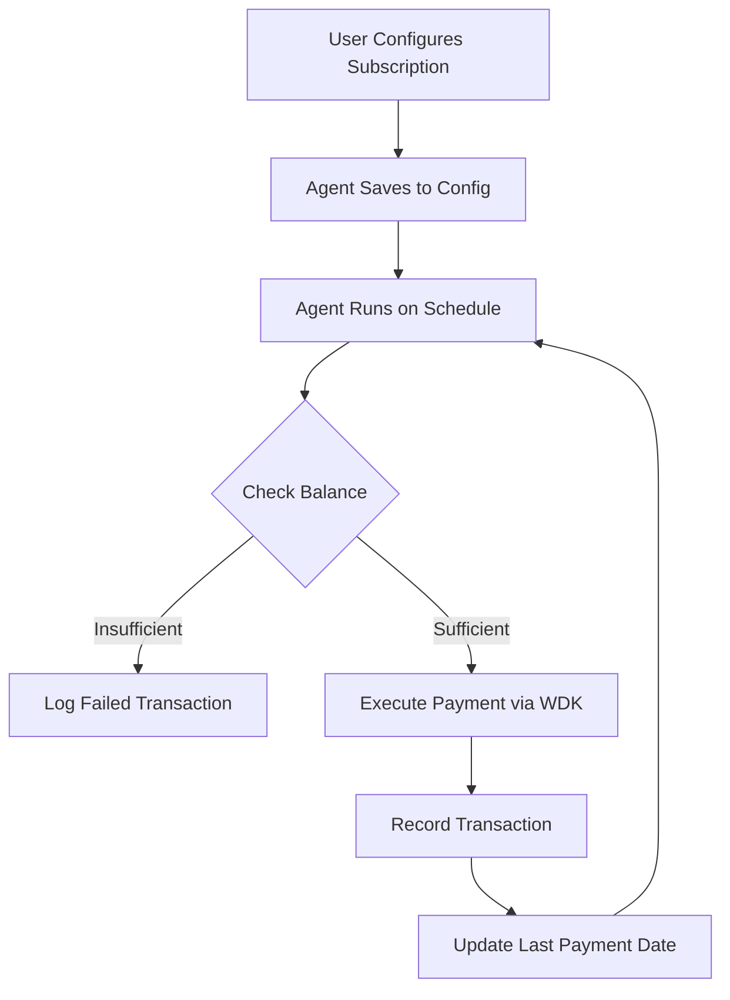

# 🤖 The Subscription Samurai

## Autonomous Recurring Payment Agent Powered by Tether WDK

[](https://nextjs.org/)
[](https://tailwindcss.com/)
[](https://www.typescriptlang.org/)
[](https://docs.wallet.tether.io/)
[](LICENSE)

---
https://subscription-samurai.vercel.app/


## 📋 Table of Contents

- [Overview](#overview)
- [Features](#features)
- [How It Works](#how-it-works)
- [Architecture](#architecture)
- [Prerequisites](#prerequisites)
- [Installation](#installation)
- [Configuration](#configuration)
- [Usage](#usage)
- [Project Structure](#project-structure)
- [API Routes](#api-routes)
- [WDK Integration](#wdk-integration)
- [Demo Guide](#demo-guide)
- [Troubleshooting](#troubleshooting)
- [Future Enhancements](#future-enhancements)
- [License](#license)

---

## 🎯 Overview

**The Subscription Samurai** is an autonomous AI agent that manages recurring payments using the Tether Wallet Development Kit (WDK). It demonstrates how AI agents can act as economic infrastructure—holding wallets, moving money, and settling value onchain without human intervention.

Built for the **Tether Hackathon Galactica: WDK Edition 1**, this project showcases:
- Self-custodial wallet management
- Autonomous recurring payments
- Economic soundness and safety features
- Real-world applicability

---

## ✨ Features

### 🏦 **Self-Custodial Wallet Management**
- Create and manage Ethereum wallets using WDK
- Secure mnemonic storage in `.env.local`
- Real-time balance checking
- Multi-chain support (EVM-compatible)

### 🤖 **Autonomous Payment Agent**
- Scheduled payment execution (daily, weekly, monthly)
- Balance checks before each transaction
- Automatic retry logic
- Comprehensive transaction history

### 🎨 **Modern Dashboard**
- Responsive design for all devices
- Dark mode support
- Real-time wallet status
- Subscription management interface
- Transaction history viewer

### 🔒 **Safety Features**
- Configurable payment limits
- Balance verification before transfers
- Failed transaction handling
- Transaction logging and history

---

## ⚙️ How It Works



1. **User Configuration**: Set up subscriptions with recipient addresses, amounts, and frequencies
2. **Agent Scheduler**: Node-cron triggers the agent at configured intervals
3. **Balance Verification**: Agent checks wallet balance before each payment
4. **Payment Execution**: If sufficient funds, agent sends USDT via WDK
5. **Transaction Logging**: All attempts (success/failure) are recorded for audit

---

## 🏗️ Architecture

```
┌─────────────────────────────────────────────────────────────┐
│                      Next.js Application                     │
├─────────────────────────────────────────────────────────────┤
│  Frontend (React/Tailwind)  │  Backend API Routes           │
│  - Wallet Status            │  - /api/wallet/*              │
│  - Subscription Form        │  - /api/agent/*               │
│  - Transaction History      │                               │
├─────────────────────────────────────────────────────────────┤
│                    WDK Integration Layer                     │
│  - Wallet Initialization                                     │
│  - Balance Checks                                            │
│  - Transaction Execution                                     │
├─────────────────────────────────────────────────────────────┤
│                    Standalone Agent Process                   │
│  - Cron Scheduling                                           │
│  - Autonomous Execution                                      │
│  - History Management                                        │
└─────────────────────────────────────────────────────────────┘
```

---

## 📦 Prerequisites

| Tool | Version | Purpose |
|------|---------|---------|
| Node.js | 20+ | JavaScript runtime |
| npm | Latest | Package manager |
| Git | Latest | Version control |
| Tether WDK Account | - | For wallet operations |
| Ethereum RPC | - | For blockchain interaction |

---

## 🚀 Installation

### 1. Clone the Repository
```bash
git clone https://github.com/holyaustin/subscription-samurai.git
cd subscription-samurai
```

### 2. Install Dependencies
```bash
npm install
```

### 3. Set Up Environment Variables
Create a `.env.local` file:
```bash
cp .env.example .env.local
```

Add your configuration:
```env
# Network Configuration
NETWORK=sepolia
RPC_URL=https://eth.drpc.org

# Wallet (auto-generated on first run)
# WALLET_MNEMONIC=your twelve word mnemonic here
```

### 4. Run the Development Server
```bash
npm run dev
```

### 5. Start the Agent (Optional - Manual)
```bash
npm run agent
```

The application will be available at `http://localhost:3000`

---

## ⚙️ Configuration

### Environment Variables

| Variable | Description | Default |
|----------|-------------|---------|
| `NETWORK` | Blockchain network | `sepolia` |
| `RPC_URL` | Ethereum RPC endpoint | `https://eth.drpc.org` |
| `WALLET_MNEMONIC` | Wallet seed phrase | Auto-generated |
| `AGENT_CHECK_INTERVAL` | Cron schedule for agent | `*/5 * * * *` |

### Agent Schedule Format
The agent uses cron syntax for scheduling:
- `*/5 * * * *` - Every 5 minutes (testing)
- `0 * * * *` - Every hour
- `0 0 * * *` - Daily at midnight
- `0 0 * * 0` - Weekly on Sunday
- `0 0 1 * *` - Monthly on the 1st

---

## 🎮 Usage

### 1. **Create a Wallet**
- Click "Create Wallet" on the dashboard
- Your wallet address and mnemonic are automatically saved

### 2. **Get Test USDT**
- Visit a faucet like [Pimlico](https://faucet.pimlico.io) or [Candide](https://faucet.candidewallet.com)
- Request test USDT on Sepolia network
- Enter your wallet address

### 3. **Add Subscriptions**
- Enter recipient address (Ethereum format)
- Set payment amount (USDT)
- Choose frequency (Daily/Weekly/Monthly)
- Click "Add Subscription"

### 4. **Start the Agent**
- Click "Start Agent" to begin automated payments
- The agent will check for due payments on schedule
- Monitor transactions in the history panel

### 5. **Monitor Activity**
- View wallet balance in real-time
- Check transaction history with status
- See failed transactions and reasons

---

## 📁 Project Structure

```
subscription-samurai/
├── app/
│   ├── api/
│   │   ├── agent/
│   │   │   ├── history/
│   │   │   │   └── route.ts      # Transaction history endpoint
│   │   │   └── start/
│   │   │       └── route.ts      # Agent control endpoints
│   │   └── wallet/
│   │       ├── balance/
│   │       │   └── route.ts      # Balance check endpoint
│   │       └── create/
│   │           └── route.ts      # Wallet creation endpoint
│   ├── components/
│   │   ├── Dashboard.tsx          # Main dashboard component
│   │   ├── SubscriptionForm.tsx   # Subscription form
│   │   ├── TransactionHistory.tsx # History viewer
│   │   └── WalletStatus.tsx       # Wallet display
│   ├── lib/
│   │   └── wdk/
│   │       └── client.ts          # WDK integration layer
│   ├── globals.css                # Tailwind CSS v4 styles
│   ├── layout.tsx                 # Root layout
│   └── page.tsx                   # Home page
├── agent-scripts/
│   └── subscription-agent.js      # Autonomous agent script
├── data/                          # Persistent data storage
│   ├── history.json               # Transaction history
│   └── subscriptions.json         # Subscription configurations
├── public/                        # Static assets
├── .env.local                     # Environment variables
├── package.json                   # Dependencies
├── postcss.config.mjs             # PostCSS configuration
├── tailwind.config.js             # Tailwind configuration
├── tsconfig.json                  # TypeScript configuration
└── README.md                      # This file
```

---

## 🔌 API Routes

### Wallet Endpoints

#### `GET /api/wallet/balance`
Returns wallet balance and address.
```json
{
  "success": true,
  "address": "0x...",
  "balance": {
    "balances": {
      "USDT": "1000.00"
    }
  }
}
```

#### `POST /api/wallet/create`
Creates a new wallet.
```json
{
  "success": true,
  "address": "0x...",
  "message": "Wallet created successfully"
}
```

### Agent Endpoints

#### `POST /api/agent/start`
Starts the autonomous agent with subscriptions.
```json
{
  "subscriptions": [
    {
      "recipient": "0x...",
      "amount": 100,
      "frequency": "weekly"
    }
  ]
}
```

#### `DELETE /api/agent/start`
Stops the running agent.

#### `GET /api/agent/history`
Returns transaction history.
```json
{
  "success": true,
  "history": {
    "transactions": [
      {
        "type": "success",
        "txId": "0x...",
        "recipient": "0x...",
        "amount": 100,
        "timestamp": "2024-01-01T00:00:00.000Z"
      }
    ]
  }
}
```

---

## 🔗 WDK Integration

This project leverages the Tether Wallet Development Kit for all blockchain operations:

### Key WDK Features Used

1. **Wallet Creation**: `WDK.getRandomSeedPhrase()` and `new WDK(seedPhrase)`
2. **Wallet Registration**: `wdk.registerWallet('evm', WalletManagerEvm, config)`
3. **Account Management**: `wdk.getAccount('evm', index)`
4. **Balance Checking**: `account.getBalance()`
5. **Transaction Execution**: `account.sendTransaction({ to, value })`

### Supported Blockchains
- **EVM-compatible chains** (Ethereum, Polygon, BSC, etc.)
- Tested on Sepolia testnet
- Can extend to other chains supported by WDK

---

## 🎬 Demo Guide https://youtu.be/L4SrdfHd0H0


---

## 🐛 Troubleshooting

### Common Issues and Solutions

#### "Cannot find addon '.' imported from sodium-native"
**Problem**: Native dependency conflict with Next.js.  
**Solution**: Use the standalone server approach (Solution 3 in our documentation) or ensure you're using WDK's browser-compatible build.

#### "Provider not connected"
**Problem**: RPC endpoint unreachable.  
**Solution**: Check your internet connection and verify RPC_URL in `.env.local`. Use a public endpoint like `https://eth.drpc.org`.

#### "Insufficient balance"
**Problem**: No test USDT in wallet.  
**Solution**: Use Sepolia faucets (Pimlico or Candide) to get test funds.

#### "Failed to fetch wallet"
**Problem**: API route returning HTML instead of JSON.  
**Solution**: Check terminal for errors, ensure environment variables are set, and verify WDK is properly installed.

#### "Module not found"
**Problem**: Missing dependencies.  
**Solution**: Run `npm install` to ensure all packages are installed.

---

## 🚀 Future Enhancements

- [ ] **Multi-chain Support**: Add TRON, Bitcoin, Solana via WDK
- [ ] **DeFi Integration**: Lend idle funds via Aave
- [ ] **Smart Splitting**: Split payments between multiple recipients
- [ ] **Telegram Bot**: Manage subscriptions via chat
- [ ] **Web3 Notifications**: Real-time transaction alerts
- [ ] **Analytics Dashboard**: Payment trends and insights
- [ ] **Social Features**: Share subscriptions with teams

---

## 🤝 Contributing

We welcome contributions! Please follow these steps:

1. Fork the repository
2. Create a feature branch (`git checkout -b feature/amazing-feature`)
3. Commit your changes (`git commit -m 'Add amazing feature'`)
4. Push to the branch (`git push origin feature/amazing-feature`)
5. Open a Pull Request

---

## 📄 License

This project is licensed under the MIT License - see the [LICENSE](LICENSE) file for details.

---

## 🙏 Acknowledgments

- **Tether WDK Team** - For providing the amazing Wallet Development Kit
- **Tether Hackathon Galactica** - For organizing this event
- **Next.js Team** - For the excellent React framework
- **Tailwind CSS** - For the utility-first CSS framework

---

## 📞 Contact & Support

- **Discord**: Join the [Tether WDK Discord](https://discord.gg/arYXDhHB2w)
- **GitHub Issues**: [Open an issue](https://github.com/holyaustin/subscription-samurai/issues)
- **Twitter**: [https://x.com/holyaustin](https://x.com/holyaustin)

---

**Built with ❤️ for the Tether Hackathon Galactica: WDK Edition 1**

*"Democratizing finance with autonomous economic infrastructure"*